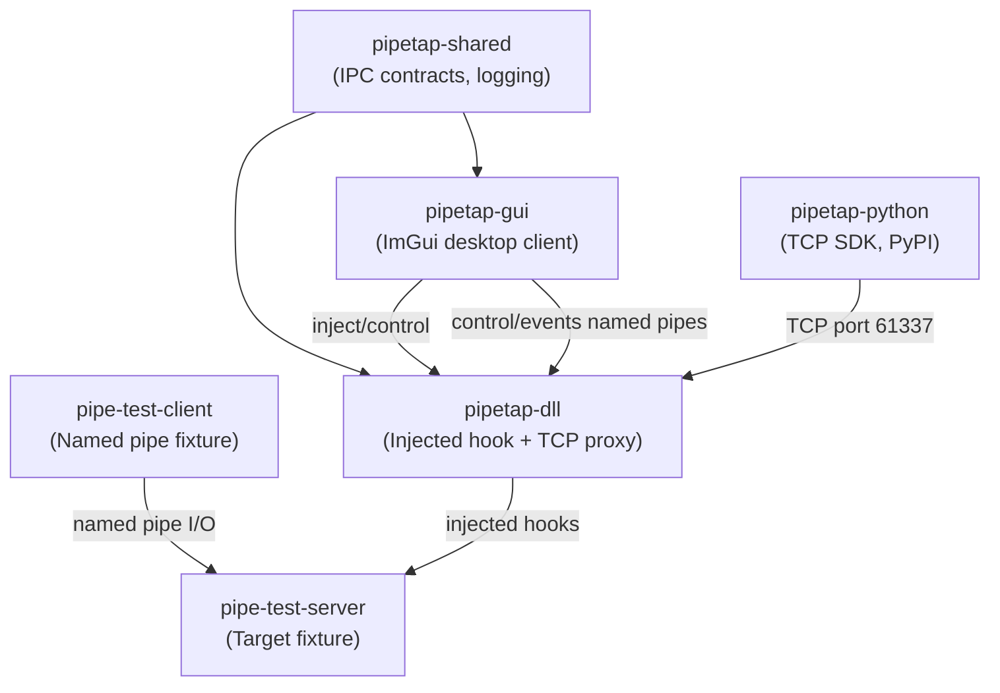
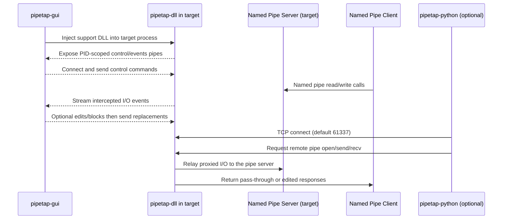

# Development Overview

## Component Relationships

The repository is split into a few cooperating parts: the ImGui desktop client (`pipetap-gui`), the injected hook + proxy DLL (`pipetap-dll`), shared contracts and logging (`pipetap-shared`), a Python SDK for the TCP-to-named-pipe proxy (`pipetap-python`), and two small fixtures to exercise the flow (`pipe-test-client`/`pipe-test-server`). The diagram shows how they depend on each other and where the DLL sits when injected into a target named-pipe server.

## Protocol Flow

Once injected, the DLL stands between the real client/server named-pipe traffic and the GUI (and optionally the Python SDK). It establishes PID-scoped control/event pipes for coordination with the GUI, continues to forward intercepted I/O to the real APIs, and exposes a TCP listener for remote pipe access. The sequence below outlines the major message paths.

