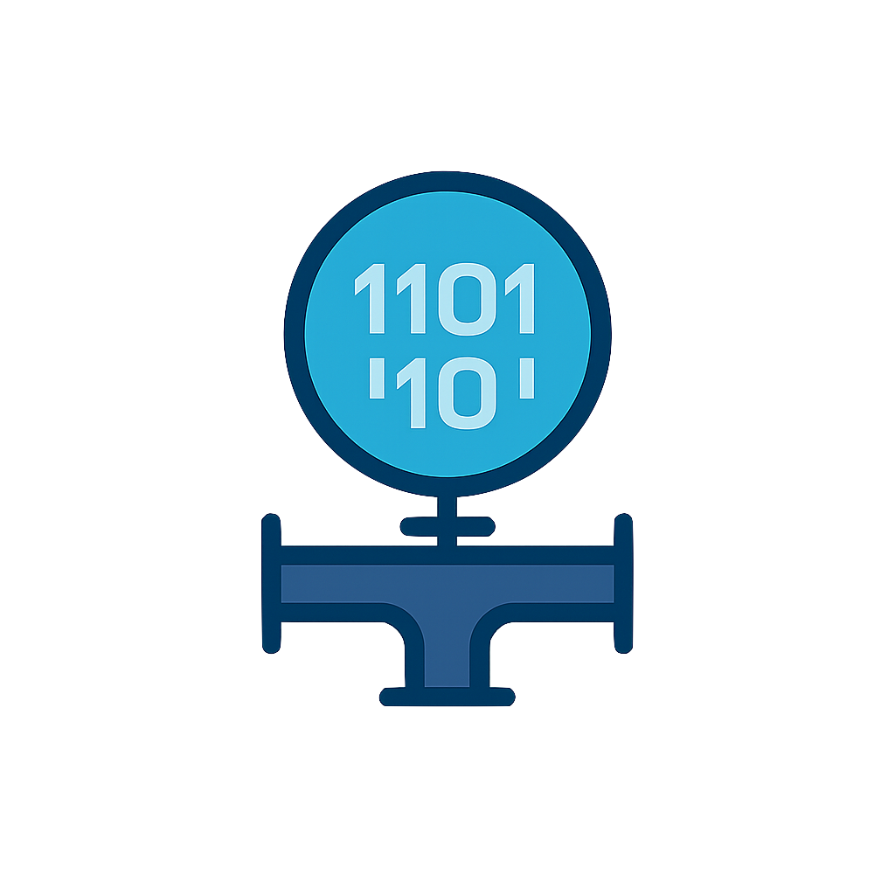
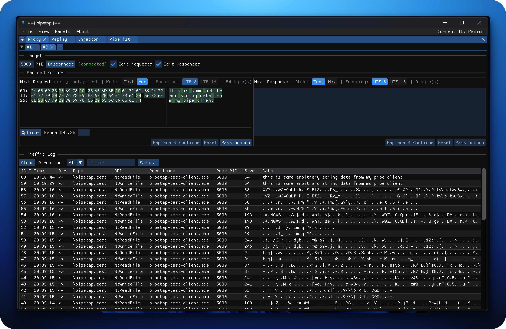

# pipetap (beta)

[](https://x.com/leonjza)

`pipetap` helps you observe, intercept, and replay traffic over [Windows Named Pipes](https://learn.microsoft.com/en-us/windows/win32/ipc/named-pipes).  



- **Traffic capture** – log named pipe related traffic based on Windows API hooks.
- **Hex/text viewers** – inspect raw payloads (with UTF-8 or UTF-16 decoding).
- **On-the-fly editing** – intercept requests/responses, modify bytes, and inject replacements before the target sees them.
- **Client** – send arbitrary traffic to named pipes.
- **Remote Client** – open remote named pipes *from inside* the target process for seamless bidirectional testing.
- **Multiple targets** – manage and switch between multiple PIDs in one GUI session.

---



## Components

- **A Support DLL** – hooks Named Pipe APIs inside the target process and streams telemetry/events out.
- **GUI** – a desktop application that connects to one or more PIDs, visualizes traffic, lets you filter, edit, replay, or proxy pipes.
- **Remote proxy** – open a named pipe *inside* the target process from the GUI and send/receive data without modifying the target’s code.

## Binaries

If you prefer not to build your own, you can grab binaries in the releases tab.

## Building

Quickstart (if you already have `VCPKG_ROOT` set).

```powershell
$preset = "x64-release"
cmake --preset $preset
cmake --build --preset $preset --target pipetap-gui pipetap-dll
```

Requirements:

- Windows 10/11
- Visual Studio 2022 (MSVC)
- [vcpkg](https://github.com/microsoft/vcpkg) bootstrapped and integtated with Visual Studio

Building via PowerShell:

- Open a "Developer PowerShell for VS 2022" terminal session, and `cd` to where you downloaded this source.
- If you don't have the `VCPKG_ROOT` environment variable set to your `vcpkg` path yet:
  - Run `$env:VCPKG_ROOT="C:\Users\<you>\Downloads\vcpkg"` (replace with your path).
- Choose the preset to build. Run `$preset = "x64-release"` for the 64bit release build. Other presets are: `x86-debug`, `x86-release`, `x64-debug`, `x64-release`, `arm64-debug` and `arm64-release`.
- Run: `cmake --preset $preset`.
- Run: `cmake --build --preset $preset --target pipetap-gui pipetap-dll pipe-test-client pipe-test-server`

Building via Visual Studio 2022:

- Ensure you have the path to `vcpkg` set in a global environment variable called `VCPKG_ROOT`. If you dont, run `setx VCPKG_ROOT "C:\src\vcpkg" /M` in an elevated cmd.exe esession.

Then:

- Open Visual Studio (Community Edition is fine).
- In the open dialog, choose "Open a local folder", then choose `pipetap` root directory.
- Give Visual Studio a few moments to read the project config, then choose the build target you want (probably a release one).
- Finally, browse to Build -> Build All.

Artifacts:

- `pipetap-dll.dll` – injected into the target process
- `pipetap-gui.exe` – desktop front-end

Some helpers are:

- `pipetap-test-server.exe` - a small named pipe server to test with
- `pipetap-test-client.exe` - a small named pipe client to test with

## Usage

When you first run `pipetap-gui.exe`, you land on the Proxy tool. This is the main view you'll use to watch, modify, and extract data from named-pipe communications that you have captured. To get some data in the traffic log, you need to inject the support DLL first.

### injector

Inject the support DLL by navigating to the Injector tool, choosing your target process, and clicking Inject Support DLL. You can also double-click the target process to inject the DLL. If your target is running in an elevated context, pipetap should be elevated too - relaunch as administrator if needed. Watch the Injector Status log for details to determine whether injection was successful.

### proxy

With the DLL injected, navigate back to the Proxy tool. A new tab connected to the support DLL should open. If you did not select Auto-connect proxy, you need to open a new tab (the last injected PID will also be an option when creating a new tab) and connect to it. If everything worked, named-pipe communications should appear in your Traffic Log. If not, interact with your target to try to generate traffic.

You can optionally enable the request/response editors. This will block communications in your target process, allowing you to edit payloads (either as UTF-8/UTF-16 strings or hex), Burp-style.

### replay

The Replay tool is a named-pipe client where you can connect to a named pipe and start interacting with it. You can either connect manually, or right-click in the proxy traffic log or the pipelist and Send to Replay to get a prepopulated replay tab set up.

Much like the proxy, you can send and receive data, which will be logged to the traffic tab.

### pipelist

The Pipelist tool is a simple named-pipe enumeration tool, revealing named-pipe servers and which processes they are bound to (among other things).

## Debugging

The support DLL writes log lines to `%appdata%\pipetap\injected.log`.

## Python SDK

One of the features of the support DLL is that it acts as a TCP-to-Named-Pipe proxy. When injected, it opens a TCP port (default: 61337, if available) that allows arbitrary external clients to connect and initiate Named Pipe connections from within the support DLL. This is particularly handy if your target Named Pipe requires more advanced data wrangling.

A Python SDK is located in the [pipetap-python](./pipetap-python/) directory and is also published on PyPI.

### sdk usage

Either grab the source or install the python package with `pip install pipetap`. With `pipetap` available, you can connect to a remote Named Pipe (from a process that has the support DLL loaded) with:

```python
from pipetap import PipeTap

tap = PipeTap()
tap.connect("pipetap.test", "10.0.0.1")

tap.send("a string\n")
tap.send(b"\xdd\x00\x00\xdd")
print(tap.recv())
```

## License

`pipetap` is licensed under a [GNU General Public v3 License](https://www.gnu.org/licenses/gpl-3.0.en.html). Permissions beyond the scope of this license may be available at [http://sensepost.com/contact/](http://sensepost.com/contact/).
